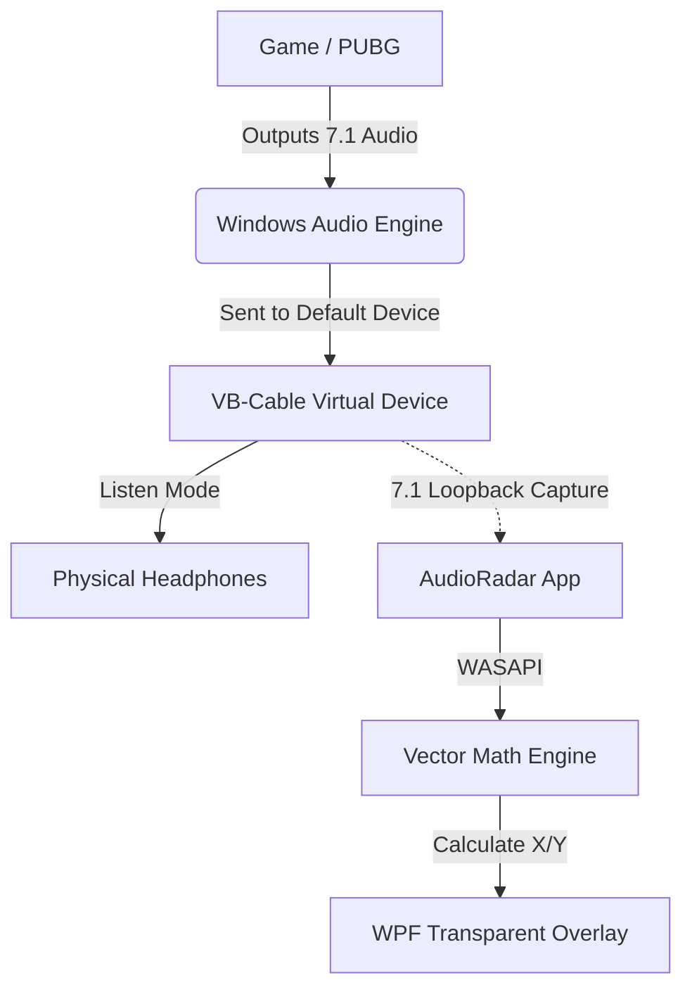

# AudioRadar: 7.1 Surround Sound Visualizer Overlay

**AudioRadar** is an accessibility and training tool designed for gamers who have difficulty distinguishing sound direction (specifically Front vs. Back) when using stereo headphones.

It intercepts 7.1 Surround Sound audio data from the Windows mixer and visualizes sound sources on a transparent "Sonar" overlay in real-time.


---

## The Problem

In standard Stereo (2.0) gaming, a sound played at **50% Left / 50% Right** is mathematically ambiguous — it could be directly in front of you or directly behind you.

Games use HRTF (Head-Related Transfer Functions) to simulate spatial depth, but visualizers cannot "read" HRTF positional cues.

---

## The Solution

**AudioRadar** relies on a 7.1 Surround Sound pipeline using VB-Cable and Windows Listen Mode (no VoiceMeeter required).

1. **Virtual Audio Device (VB-Cable)**  
   Windows is configured to treat VB-Cable as a 7.1 Home Theater device.

2. **Listen Mode Routing**  
   Windows “Listen to this device” is enabled so the 7.1 audio sent to VB-Cable is forwarded to your physical headphones.

3. **Channel Interception (WASAPI Loopback)**  
   The app captures the raw 7.1 channel data from VB-Cable using `WasapiLoopbackCapture`.

4. **Vector Math Engine**  
   Using custom-tuned multipliers, the app calculates the sound direction and plots it on a 2D radar overlay.

---

## Architecture



---

## Prerequisites

- **OS:** Windows 10 / 11  
- **Runtime:** .NET 6.0 or .NET 8.0  
- **Audio Driver:** VB-Cable (VB-Audio Virtual Cable)  

---

## Setup Guide (Important)

### 1️⃣ Install VB-Cable

- Install VB-Cable driver.
- Restart your PC.
- Open Windows Sound Settings (`mmsys.cpl`).

---

### 2️⃣ Configure VB-Cable as 7.1

- Set **CABLE Input (VB-Audio Virtual Cable)** as your Default Playback Device.
- Right-click → **Configure Speakers**.
- Select **7.1 Surround** and complete the wizard.

---

### 3️⃣ Enable Listen Mode

- Go to the **Recording** tab in Sound Settings.
- Find **CABLE Output**.
- Right-click → **Properties**.
- Open the **Listen** tab.
- Enable **Listen to this device**.
- Select your physical headphones as the playback device.

This routes the 7.1 signal to your headphones while preserving the multi-channel stream.

---

### 4️⃣ Launch AudioRadar

- Run the application.
- A transparent radar overlay will appear in the top-right corner.
- Launch your game.
- Ensure the game's audio settings are set to **Surround** or **Auto**.

---

## How The Math Works

The core logic resides in `MainWindow.xaml.cs`.

To distinguish Front vs Back and prevent channel blending, weighted multipliers are applied:

```csharp
float leftPush = fl + (bl * 3.0f) + (sl * 4.0f);
float rightPush = fr + (br * 3.0f) + (sr * 4.0f);
```

### Channel Weights

- **Front (FL / FR):** 1.0x (Baseline)
- **Rear (BL / BR):** 3.0x Boost
- **Side (SL / SR):** 4.0x Boost

This weighted vector system compensates for Windows downmix behavior and channel energy imbalance.

---

## Disclaimer & Risk Warning

Use at your own risk.

This software:
- Uses standard Windows Audio APIs (WASAPI)
- Does NOT inspect game memory
- Does NOT inject code into games

However, anti-cheat systems may flag unknown overlays interacting with game sensory data.

### Recommended Usage

- Single-player games
- Accessibility assistance
- Training environments

Avoid use in ranked or competitive multiplayer matches where external assistance is prohibited.

---

## License

This project is open-source.

Feel free to fork, modify, and improve.

---

## Future Improvements

- Adjustable sensitivity slider
- Dynamic color shifting based on loudness
- Dot size scaling with intensity
- True vector-based spatial mapping
- UI configuration panel

---

**Built with C#, WPF, and NAudio**