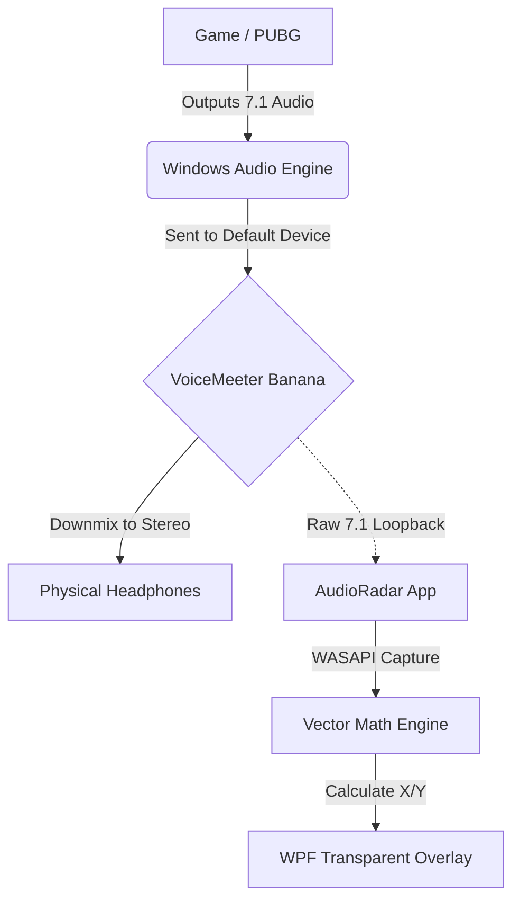

# AudioRadar: 7.1 Surround Sound Visualizer Overlay

**AudioRadar** is an accessibility and training tool designed for gamers who have difficulty distinguishing sound direction (specifically Front vs. Back) when using stereo headphones.

It intercepts 7.1 Surround Sound audio data from the Windows mixer and visualizes sound sources on a transparent "Sonar" overlay in real-time.


---

##  The Problem

In standard Stereo (2.0) gaming, a sound played at **50% Left / 50% Right** is mathematically ambiguous — it could be directly in front of you or directly behind you.

Games use HRTF (Head-Related Transfer Functions) to simulate spatial depth, but visualizers cannot "read" HRTF positional cues.

---

##  The Solution

**AudioRadar** relies on a 7.1 Surround Sound pipeline.

1. **Virtual Input**  
   We force Windows to treat the audio device as a 7.1 Home Theater system.

2. **Channel Interception**  
   The app captures individual channel data (Rear Left, Rear Right, Side Left, Side Right).

3. **Vector Math Engine**  
   Using custom-tuned multipliers, the app calculates the sound direction and plots it on a 2D radar overlay.

---

##  Architecture



---

##  Prerequisites

- **OS:** Windows 10 / 11  
- **Runtime:** .NET 6.0 or .NET 8.0  
- **Audio Driver:** VoiceMeeter Banana (Required to spoof 7.1 audio)  

---

##  Setup Guide (Important)

For this software to work correctly, you must configure audio routing properly.

### 1️⃣ Configure VoiceMeeter Banana

- Install VoiceMeeter Banana and restart your PC.
- Open VoiceMeeter.
- Set **Hardware Out A1** to your physical headphones.
- In the **Virtual Inputs (Voicemeeter VAIO)** section, ensure button **A1** is green (enabled).
- In the **Master Section**, change the "Normal Mode" button for A1 to **Mix Down A**.  
  This ensures 7.1 audio is downmixed to stereo for your headphones.

---

### 2️⃣ Configure Windows Sound

- Open Windows Sound Settings (`mmsys.cpl`).
- Set **VoiceMeeter Input (VB-Audio VoiceMeeter VAIO)** as your Default Device.
- Right-click it → **Configure Speakers**.
- Select **7.1 Surround** and complete the wizard.

---

### 3️⃣ Launch AudioRadar

- Run the application.
- A transparent radar overlay will appear in the top-right corner.
- Launch your game.
- Ensure the game's audio settings are set to **Surround** or **Auto**.

---

##  How The Math Works

The core logic resides in `MainWindow.xaml.cs`.

To distinguish Front vs Back and prevent channel blending, weighted multipliers are applied:

```csharp
float leftPush = fl + (bl * 3.0f) + (sl * 4.0f);
float rightPush = fr + (br * 3.0f) + (sr * 4.0f);
```

### Channel Weights

- **Front (FL / FR):** 1.0x (Baseline)
- **Rear (BL / BR):** 3.0x Boost (Distinguishes from Front)
- **Side (SL / SR):** 4.0x Boost (Ensures strong horizontal movement)

This weighted vector system compensates for Windows downmix behavior and channel energy imbalance.

---

##  Disclaimer & Risk Warning

Use at your own risk.

This software:
- Uses standard Windows Audio APIs (WASAPI)
- Does NOT inspect game memory
- Does NOT inject code into games

However, anti-cheat systems (e.g., BattlEye, Ricochet, etc.) may flag transparent overlays interacting with game sensory data.

### Recommended Usage

- Single-player games
- Accessibility assistance
- Training environments

Avoid use in ranked or competitive multiplayer matches where external assistance is prohibited.

---

##  License

This project is open-source.

Feel free to fork, modify, and improve.

---

##  Future Improvements

- Adjustable sensitivity slider
- Dynamic color shifting based on loudness
- Dot size scaling with intensity
- True vector-based spatial mapping system
- UI configuration panel

---

**Built with C#, WPF, and NAudio**